# Open Access and Patent Citations in Chinese Transportation Research, 2003–2024


> **What this is.** A descriptive/associational study of how open-access (OA) status, OA route (Gold/Green/Hybrid/Bronze) and academic visibility relate to the
> **patent-citation rate** of transportation-related papers by authors at 33 leading Chinese institutions (Lens.org, 12,020 records = 9,903 unique papers, 2003–2024).
> Every paper in the sample is cited by at least one patent, so all estimates are **conditional on prior patent citation** (intensive margin) and are
> **associations, not causal effects**. OA status is measured at extraction and is undated.

---

## Contents
1. [Key findings](#1-key-findings) · 2. [Figures](#2-figures) · 3. [Repository layout](#3-repository-layout) · 4. [Data](#4-data) · 5. [Quick start](#5-quick-start) ·
6. [Pipeline](#6-pipeline) · 7. [Statistical approach](#7-statistical-approach) · 8. [Results tables](#8-results-tables) · 9. [Specification history & multiplicity](#9-specification-history-and-multiplicity) ·
10. [Corrections & caveats](#10-corrections-and-caveats) · 11. [Limitations](#11-limitations) · 12. [Citation, licence, contact](#12-citation-licence-contact)

---

## 1. Key findings

Rate ratios (RR) are on the **latent (untruncated) patent-citation rate** from zero-truncated Poisson (ZTP) models with research-cluster and year fixed effects; 95% CIs use *t*(24) with SEs clustered on 25 research clusters.

| Hypothesis | Estimate | Reading |
|---|---|---|
| **H1** OA vs closed | RR **1.52** [1.36, 1.71]; **1.34** [1.21, 1.48] adjusting for academic citations; 1.37 [1.25, 1.51] with pub-type + field tags | Higher patent-citation rate for OA-classified papers (Holm p = .007 over all 7 tests) |
| H1, publisher-hosted only | Gold/Hybrid vs closed: **1.29** [1.07, 1.55]; **1.26** [1.05, 1.50] adjusted | Not explained by retrospective coding of repository copies alone (timing still unverified) |
| H1, one row per paper | 1.53 [1.34, 1.73]; 1.33 [1.20, 1.47] (9,903 papers) | Same as record-level results |
| **H2a** visibility (exploratory) | OA × centred log academic citations: **1.15** per log-unit [1.01, 1.30]; OA RR 0.91 → 1.20 → 1.52 at the 10th/50th/90th percentile | OA premium larger for already-visible papers; Holm p = .048 over all 7 → borderline, replication needed |
| **H2b** periods (post hoc) | 2015–19 ÷ 2003–09 = **0.61** [0.33, 1.12]; trend per 5 y = 0.81 [0.65, 1.02] | Imprecise: compatible with both narrowing and stability; no policy attribution |
| **H3** Green vs Gold | Before adjustment **1.59** [1.22, 2.07] → after adjusting for academic citations **1.17** [0.89, 1.54] (M1), 1.10 [0.81, 1.49] (M2) | Gap shrinks clearly (ratio of gaps 1.36 [1.24, 1.49]); residual gap not distinguishable from 1 |
| H3 Bronze vs Gold | **0.67** [0.54, 0.83] (adjusted) | Only route contrast stable across adjustments; Bronze is also the least consistently classified colour |

ZTNB is reported as a **direction check only** (dispersion parameter at the upper bound). Lens and Unpaywall agree on binary OA for 93.7% of records and on colour for 88.1% (83.3% among Lens-OA records).

---

## 2. Figures

All figures are generated from code in `scripts/figures/`; PNG + vector PDF are in [`figures/`](figures/). Numbering follows the manuscript ([`figures/README.md`](figures/README.md) maps legacy script names).

### Main text

**Fig. 1 — Sample construction and exclusions**

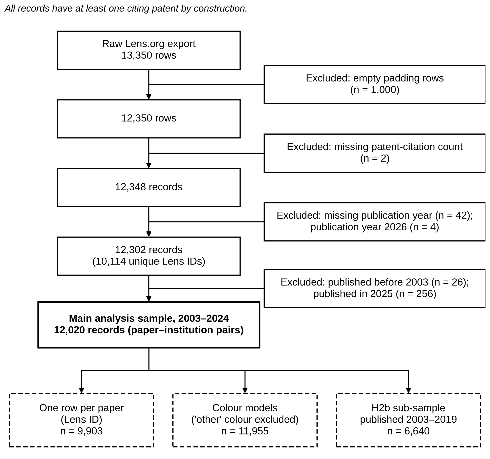

**Fig. 2 — Annual patent-cited records and OA share, 2003–2024** (Wilson 95% intervals; open marker = fewer than 20 records)

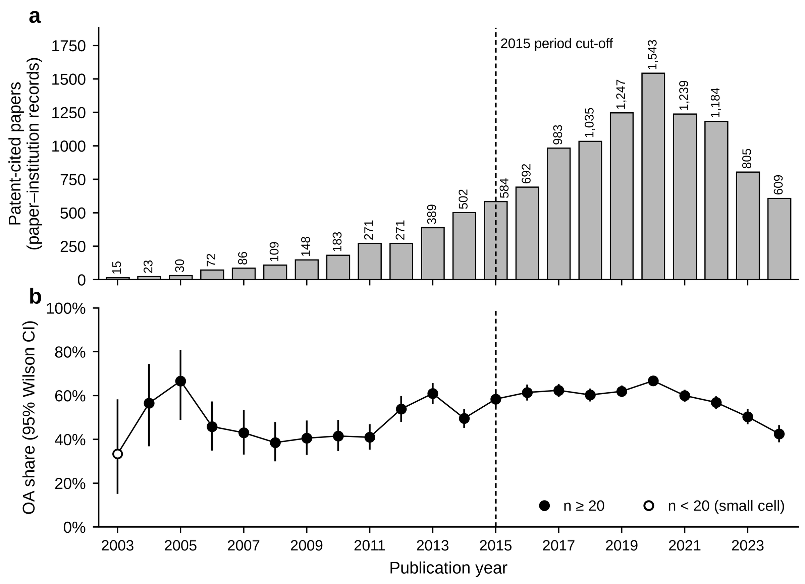

**Fig. 3 — H1: OA rate ratios (OA-classified vs closed)** — filled markers unadjusted, open markers adjusted for academic citations; ZTNB rows are a direction check

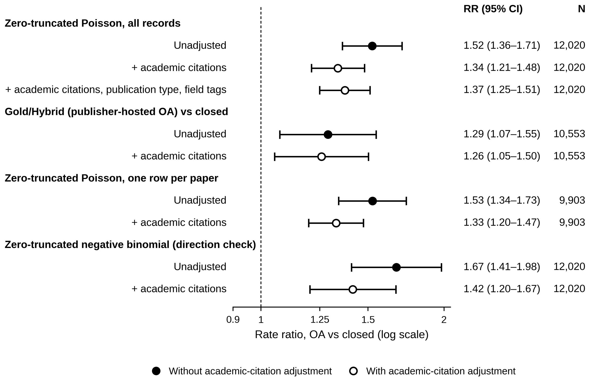

**Fig. 4 — H2a: OA rate ratio by academic visibility (exploratory)** — (a) interaction model, (b) terciles

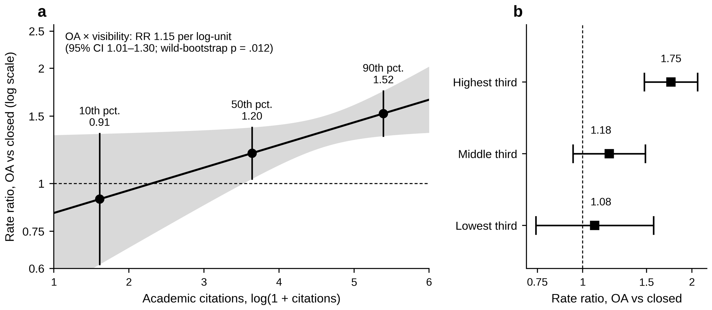

**Fig. 5 — H2b: OA rate ratio by publication period (post hoc)**

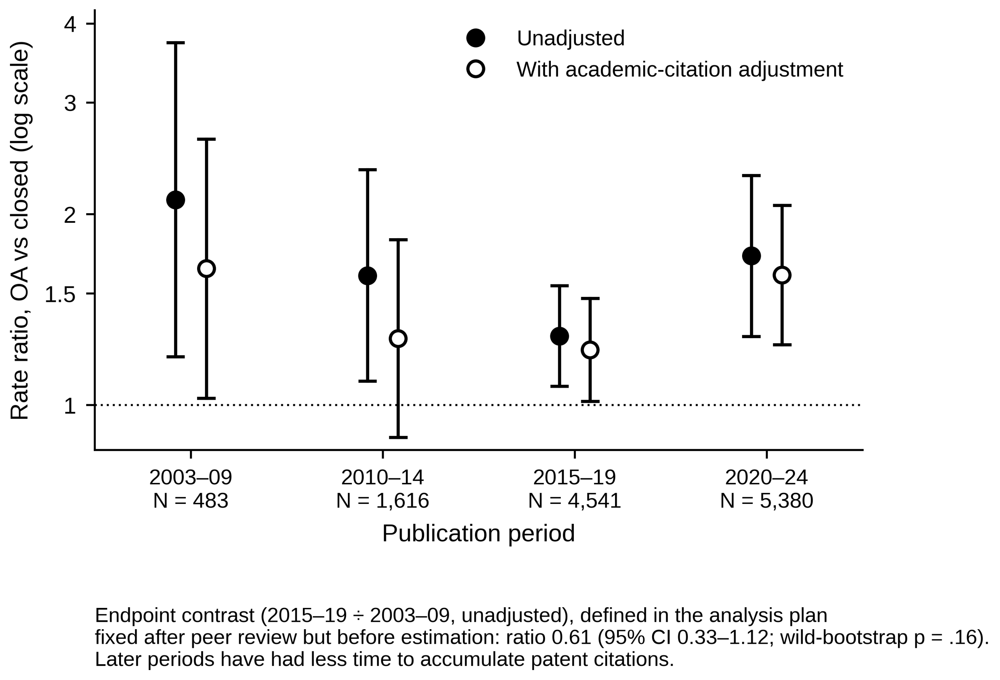

**Fig. 6 — OA colour composition by publication period**

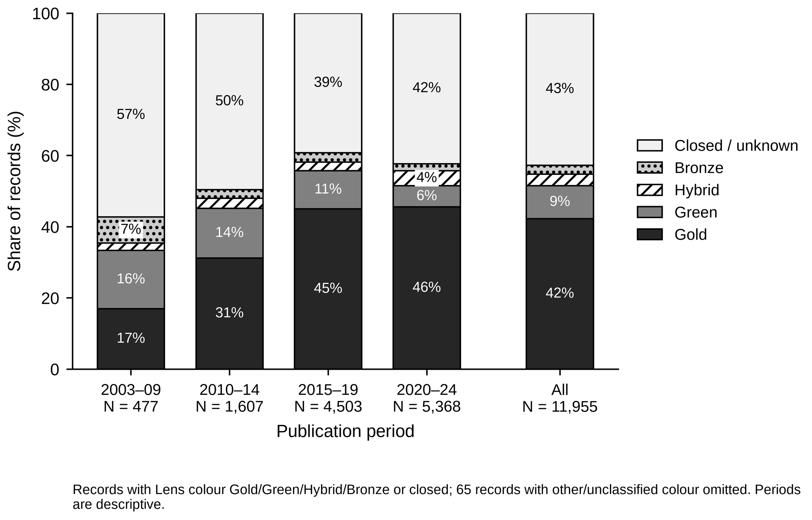

**Fig. 7 — Cumulative academic citations by OA colour** (not age-standardised)

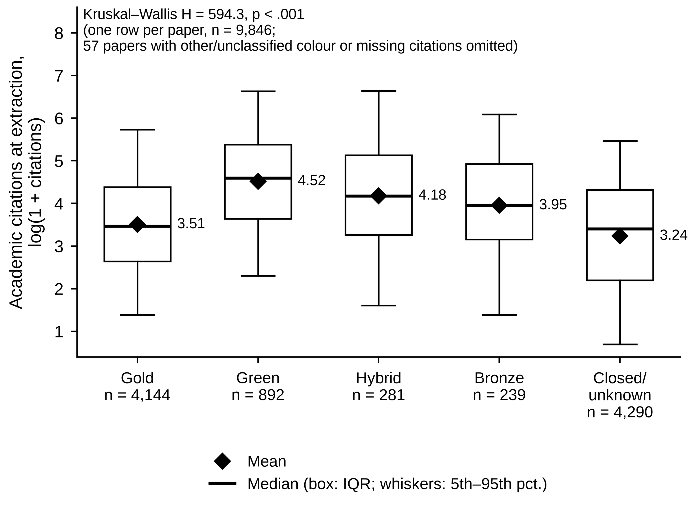

**Fig. 8 — H3: colour rate ratios and Green/Gold, Bronze/Gold contrasts** under M0, M1, M2

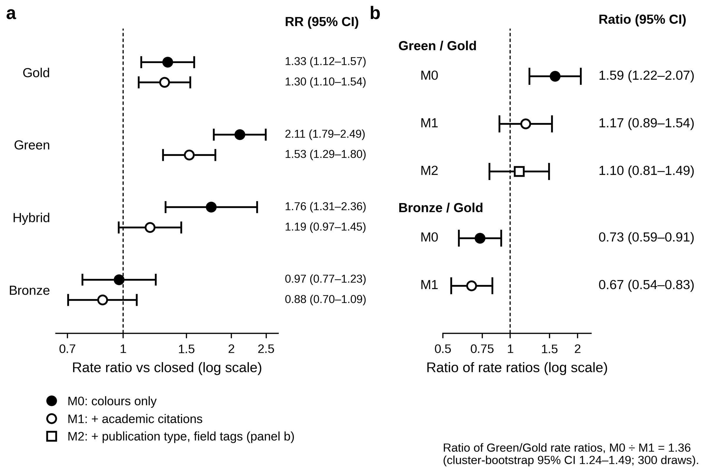

### Appendix

**Fig. A1 — Lens.org vs Unpaywall OA-colour cross-classification**

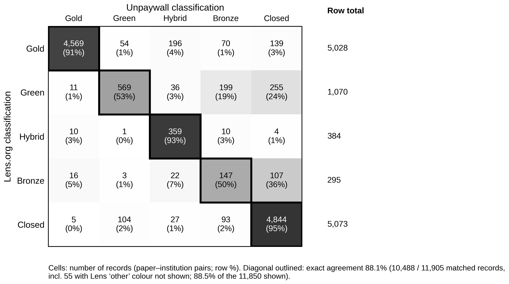

**Fig. A2 — Citing patents per record by OA status and colour** (only counts are available; maximum 159)

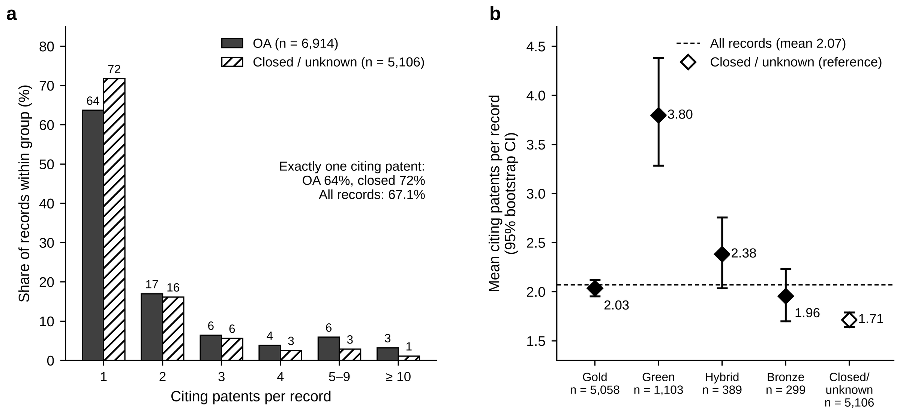

**Fig. A3 — UMAP layout of the 25 archived research clusters** (layout regenerated for display; labels are the archived assignment)

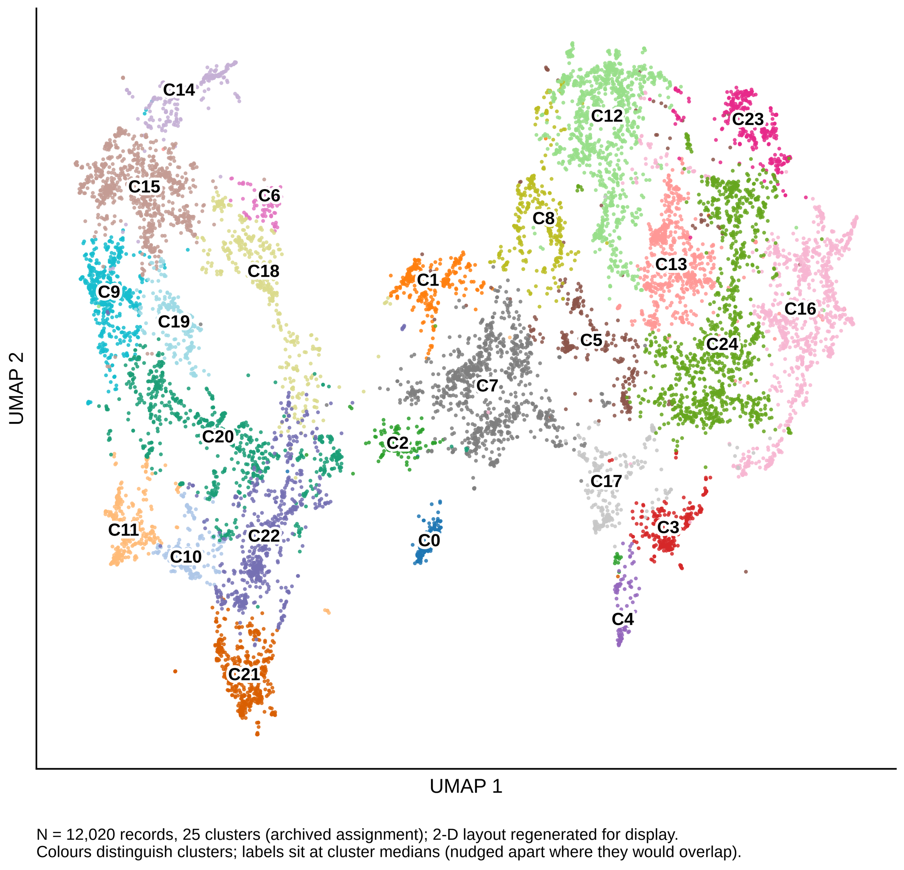

**Fig. A4 — Leave-one-institution-out re-estimates for H1, H2a and H3**

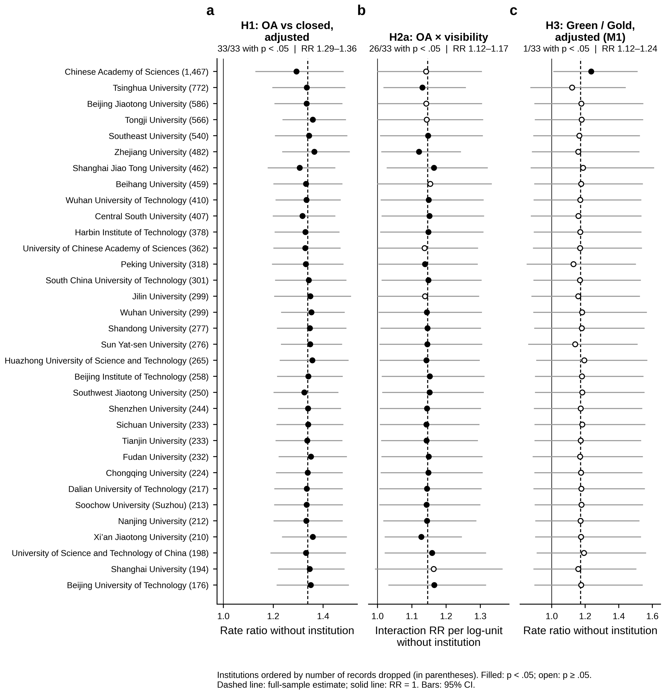

> Figures 2, 6, 7, A2 and A3 are computed from the licensed raw export; the other seven are rebuilt from the ledger with `make figures`. Run `make check-figures` to see which PNGs are present in your checkout.

---

## 3. Repository layout

```
oa-patent-citations-china-transportation/
├── README.md
├── LICENSE                                   MIT (code + derived tables; NOT the Lens export)
├── CITATION.cff
├── CHANGELOG.md
├── Makefile                                  install | synthetic | smoke | test | ledgers | figures | figures-all | replicate
├── run_all.sh                                full replication on the licensed export
├── requirements.txt / requirements-figures-umap.txt
├── .gitignore
├── .github/
│   ├── workflows/ci.yml                      syntax + pytest (ledger checks + synthetic smoke) on py3.10/3.12
│   ├── ISSUE_TEMPLATE/replication_issue.md
│   └── PULL_REQUEST_TEMPLATE.md
├── data/
│   ├── README.md                             sample construction, query, cluster archive, Unpaywall cache
│   ├── DATA_DICTIONARY.md                    columns read by the pipeline
│   ├── raw/                                  (git-ignored) Lens export
│   ├── processed/                            (git-ignored) export + archived `cluster`
│   └── synthetic/                            (git-ignored, generated) random data for smoke tests
├── scripts/
│   ├── pipeline/                             keep in ONE folder (steps import each other)
│   │   ├── step1_redesign_analysis.py        exploratory: log(1+y) OLS, H1–H3, breakpoints, decomposition, window sensitivity
│   │   ├── step2_compression_checks.py       exploratory: is period "compression" an exposure/functional-form artefact?
│   │   ├── step3_primary_plan.py             PRIMARY: zero-truncated Poisson, P1–P4, wild score bootstrap, Holm
│   │   ├── step4_revised_H2H3.py             revised H2a / H2b / H3 attenuation (P5–P7)
│   │   ├── step5_full_pipeline.py            runs steps 3+4, ZTNB, data facts, paper-level dedup, Unpaywall → FINAL_REPORT.md
│   │   └── step6_remaining.py                institution harmonisation, SE by institution, institution FE, leave-one-institution-out
│   ├── figures/
│   │   ├── make_figures.py                   7 ledger-based figures (Fig. 1, 3, 4, 5, 8, A1, A4)
│   │   ├── make_data_figures.py              5 data-driven figures (Fig. 2, 6, 7, A2, A3) – needs raw data
│   │   ├── make_fig3_umap.py                 standalone UMAP figure + cluster top-terms table
│   │   └── collect_figures.sh                copies generated files to figures/ with manuscript numbering
│   └── utils/
│       ├── build_results_ledgers.py          rebuilds results/*.csv from the transcribed report numbers
│       ├── agreement_from_crosstab.py        correct Lens–Unpaywall agreement (88.1% / 83.3%)
│       ├── unpaywall_pilot.py                the oa_date pilot (oa_date == publication date → no date variables used)
│       └── check_figures.py                  which of the 12 figures are present
├── results/
│   ├── primary/
│   │   ├── primary_tests_P1_P7.csv           the seven primary tests, Holm (family / all 7), status
│   │   ├── ALL_LEDGER.csv                    every reported coefficient
│   │   ├── h1_ledger.csv  h2_periods_ledger.csv  h2a_visibility_ledger.csv  h2b_trend_ledger.csv  h3_colour_ledger.csv
│   │   └── sample_flow.csv                   13,350 → 12,020 records
│   ├── robustness/
│   │   ├── ztp_vs_ztnb.csv  ztnb_ledger.csv  ztnb_dispersion.csv
│   │   ├── rows_vs_dedup.csv  dedup_ledger.csv
│   │   ├── institution_robustness_ledger.csv
│   │   ├── C3_leave_one_institution_out.csv  C3_leave_one_institution_out_summary.csv
│   │   └── sample_window_sensitivity_logOLS.csv
│   ├── unpaywall/
│   │   ├── lens_colour_vs_unpaywall_status.csv
│   │   └── repository_and_green_version_ledger.csv
│   └── exploratory/
│       ├── step1_log1p_first_round_key_coefficients.csv
│       └── step2_descriptives_period_by_oa.csv
├── figures/
│   ├── README.md                             numbering map, provenance of each figure
│   ├── main/      Fig1_sample_flow · Fig2_annual_papers_oa_share · Fig3_H1_forest · Fig4_H2a_visibility · Fig5_H2b_periods
│   │              Fig6_colour_composition · Fig7_academic_citations_by_colour · Fig8_H3_colour        (.png + .pdf each)
│   └── appendix/  FigA1_lens_vs_unpaywall · FigA2_patent_counts · FigA3_umap_clusters · FigA4_leave_one_institution_out
├── docs/
│   ├── METHODS.md                            model, inference, test families
│   ├── RESULTS_GUIDE.md                      what each results/ file is and where it appears in the paper
│   ├── REPRODUCIBILITY.md                    seeds, plan hashes, dependencies, non-determinism
│   └── CORRECTIONS.md                        differences from the first submission + pipeline bugs fixed
└── tests/
    ├── make_synthetic_data.py                random data in the Lens-export layout
    ├── test_ledgers.py                       arithmetic/consistency of curated tables (sample flow, Holm, agreement, LOO counts)
    └── test_smoke_pipeline.py                step 3 end-to-end on synthetic data
```

---

## 4. Data

**Record-level data are not redistributed** (Lens.org terms of use). Full instructions: [`data/README.md`](data/README.md); columns: [`data/DATA_DICTIONARY.md`](data/DATA_DICTIONARY.md).

| Item | Value |
|---|---|
| Source | Lens.org Scholarly Works with citing-patent links; OA status/colour merged by Lens from DOAJ, PMC, CORE, Unpaywall, OpenAlex |
| Query | title/abstract/keyword "transportation"; ≥ 1 citing patent; 33 Chinese institutions (Table A1); no year limit (records span 1992–2026) |
| Raw → analysis | 13,350 rows → 12,348 → 12,302 → **12,020 records (2003–2024)** = **9,903 unique papers**; 11,955 records in colour models |
| Unit | paper–institution pair (a paper appears once per matching institution) |
| Outcome | number of distinct citing patent documents (mean 2.07; 67.1% of records have exactly one; max 159) |
| Treatment | Lens binary OA (57.5% of records; 56.7% of papers); colour: Gold 5,058 · Green 1,103 · Hybrid 389 · Bronze 299 · closed 5,106 · unclassified 65 |
| `cluster` | 25 archived research clusters (MiniLM-L6-v2 → UMAP → HDBSCAN); used as fixed effects and inference level; **must be supplied** (re-clustering gives 20 clusters) |

---

## 5. Quick start

```bash
git clone https://github.com/LEEYJ1021/oa-patent-citations-china-transportation.git
cd oa-patent-citations-china-transportation
python3 -m venv .venv && source .venv/bin/activate
make install

# (a) no licensed data needed: unit tests + full pipeline on synthetic data
make test
make smoke

# (b) rebuild curated result tables and the 7 ledger-based figures
make ledgers
make figures

# (c) full replication with the licensed export
mkdir -p data/processed && cp /path/to/Transport_CN_Scholarly_Works_with_cluster.csv data/processed/
RAW=data/processed/Transport_CN_Scholarly_Works_with_cluster.csv bash run_all.sh
# add Unpaywall (≈10k DOIs, resumable cache):
FETCH_UNPAYWALL=1 UNPAYWALL_EMAIL=you@univ.edu RAW=... bash run_all.sh
```

Environment variables used by the scripts: `RV_RAW` (input CSV), `RV_OUT` (output dir), `RV_YEAR_MIN/RV_YEAR_MAX` (default 2003/2024), `RV_BOOT` (wild score bootstrap, 999), `RV_BOOT_ATT` (cluster bootstrap, 300),
`RV_BOOT_MED` (step1 decomposition), `RV_FETCH`/`RV_EMAIL` (Unpaywall), `RV_RAW_FULL` (file with zero-patent papers → hurdle block), `RV_INST_COL`, `RV_LOO_MIN` (step6).

---

## 6. Pipeline

| Step | Script | Role | Status in paper |
|---|---|---|---|
| 1 | `step1_redesign_analysis.py` | log(1+y) OLS, CRV1/wild-cluster bootstrap, breakpoint sweep 2012–2016, lagged-cluster-share moderation, colour models, decomposition, window sensitivity | exploratory (Table A3, Table A2, App. B) |
| 2 | `step2_compression_checks.py` | period contrasts under log / P(≥2) / P(≥3) / PPML, exposure-comparable samples, annual premium | exploratory (motivated the ZTP redesign; ranged from small negative to ≈ 0 by outcome) |
| 3 | `step3_primary_plan.py` | **primary**: ZTP, P1–P4, wild score bootstrap, Holm; writes plan + SHA-256 before estimation | Tables 2–5 |
| 4 | `step4_revised_H2H3.py` | H2a visibility, H2b trend + omnibus Wald, H3 gap attenuation (P5–P7) | Tables 3, 5 |
| 5 | `step5_full_pipeline.py` | steps 3+4, ZTNB (direction check), sample facts, **paper-level dedup (M5)**, Unpaywall (O1) | Sec. 4.4, App. A |
| 6 | `step6_remaining.py` | institution harmonisation; SE by institution; institution FE; leave-one-institution-out | Sec. 4.4, Fig. A4 |

Outputs of a full run land in `outputs/` (git-ignored); the curated versions are in `results/`.

---

## 7. Statistical approach

For record *i* in cluster *c*, year *t*: `E[y_ict] = exp(β·OA_i + γ·lc_i + α_c + λ_t)`, estimated on the truncated (y ≥ 1) likelihood.

* **Effects** are rate ratios exp(β) on the latent rate — not comparable to log-scale OLS (Table A3) or to earlier percentage effects.
* **Fixed effects** absorb paper age (age is a function of year), so no offset is used.
* **Inference with 25 clusters:** CRV1 with t(G−1); null-imposed wild score bootstrap (999 draws; floor p = .001); cluster bootstrap (300 draws) for gap attenuation → "p < .01".
* **ZTNB:** own likelihood; dispersion at the search bound (α = e¹⁰) ⇒ direction check only; RRs differ by up to ≈ 10% from ZTP, direction and significance unchanged.
* **H3 models:** M0 colours; M1 + log academic citations; M2 + publication type + field tags. Closed/unknown is the reference; 65 "other" records dropped.
* **Multiplicity:** Holm within family and over all seven primary tests.

Details: [`docs/METHODS.md`](docs/METHODS.md).

---

## 8. Results tables

| Test | Spec | RR | 95% CI | p (t) | p (boot) | Holm (all 7) | Status |
|---|---|---|---|---|---|---|---|
| P1 | H1 total | 1.524 | [1.361, 1.706] | <.001 | .001 | .007 | specified before ZTP estimation |
| P2 | H1 + academic citations | 1.338 | [1.211, 1.480] | <.001 | .001 | .007 | same |
| P3 | H2 endpoint 2015–19 ÷ 2003–09 | 0.609 | [0.331, 1.122] | .107 | .161 | .348 | same |
| P4 | H3 Green/Gold (M1) | 1.172 | [0.894, 1.536] | .239 | — | .348 | same |
| P5 | H2a OA × visibility | 1.146 | [1.009, 1.301] | .037 | .012 | .048 | exploratory |
| P6 | H2b trend per 5 y (≤ 2019) | 0.814 | [0.652, 1.017] | .069 | .116 | .348 | post hoc |
| P7 | H3 gap attenuation gap(M0)/gap(M1) | 1.355 | [1.243, 1.489] | .007 | — | .033 | exploratory |

Robustness at a glance (see [`docs/RESULTS_GUIDE.md`](docs/RESULTS_GUIDE.md)):

| Check | H1 (adj.) | H2a | H3 Green/Gold (M1) |
|---|---|---|---|
| Main (records, ZTP) | 1.34 [1.21, 1.48] | 1.15 [1.01, 1.30] | 1.17 [0.89, 1.54] |
| One row per paper | 1.33 [1.20, 1.47] | 1.13 [1.02, 1.25] | 1.11 [0.89, 1.38] |
| ZTNB (direction check) | 1.42 [1.20, 1.67] | 1.19 [1.06, 1.33] | 1.22 [0.94, 1.58] |
| SE by institution (G = 33) | 1.34 [1.19, 1.51] | 1.15 [1.05, 1.26] | 1.17 [0.99, 1.39] |
| Institution FE | 1.31 [1.19, 1.44] | 1.16 [1.02, 1.32] | 1.16 [0.90, 1.51] |
| Leave-one-institution-out (33 fits) | 1.29–1.36, significant 33/33 | 1.12–1.17, significant 26/33 | 1.12–1.24, significant 1/33 (drop CAS) |

---

## 9. Specification history and multiplicity

* Steps 1–2 were **exploratory** log-scale analyses of the same data. The four tests P1–P4 were then fixed in `step3_primary_plan.py` (plan hashed to disk before estimation) — after that exploratory round, so this is **not** a pre-registration.
* P5–P7 were formulated after inspecting step 3 results; P6 is post hoc. Several hundred coefficients were fitted across steps; all reported ones are in `results/primary/ALL_LEDGER.csv`.
* Holm covers only the seven primary tests; H2a is borderline after adjustment (.048) and not invariant to dropping individual institutions (26/33).
* **Not estimated on purpose:** event-study, stacked DiD, IV/Bartik and continuous dose-response designs (OA status is undated; no single identifiable adoption event). A Baron–Kenny-style decomposition (16% of the log-OLS OA coefficient, CI for the indirect part 0.003–0.025) is in Appendix B and is **not** a mechanism test.
* Unpaywall's `oa_date` equals the publication date for repository copies in a 239-location pilot (mean lag −0.01 y, SD 0.09), so **no date variables are used**.

---

## 10. Corrections and caveats

[`docs/CORRECTIONS.md`](docs/CORRECTIONS.md) lists every difference from the first submission (sample flow, institution list, unit of observation, variable definitions, withdrawn analyses) and the pipeline bugs fixed while rebuilding
(ZTNB alpha reporting, Unpaywall field location, a wrong 47.4% agreement figure — the correct values are 88.1% / 83.3%).

Things to keep in mind when reusing the numbers:
* The `g_oth` Green split in `results/unpaywall/…ledger.csv` includes 299 Green records with **no version information**; do not read it as "accepted/published versions".
* The chart script `make_figures.py` uses numbers copied from the analysis ledger; if you re-run the pipeline on different data, update them (or regenerate from `outputs/final/ALL_LEDGER.csv`).
* Hurdle model (block O2) was **not run**: no file with zero-patent papers exists.

---

## 11. Limitations

Conditional on ≥ 1 citing patent (no extensive margin) · purposive 33-institution set, single keyword, English/DOI-biased Lens coverage · OA status undated, classification differs across databases (Bronze and Green least stable) ·
academic citations are cumulative and may follow OA · patent citations are counts only (no source, applicant, family, date) · ZTP relies on the truncated-Poisson assumption and ZTNB is at its dispersion bound ·
many specifications examined; H2a borderline; H2b post hoc · archived cluster partition cannot be regenerated exactly · unadjusted Green/Gold contrast is influenced by the heavy right tail.

---

Code and derived result tables: MIT (see [LICENSE](LICENSE)). Lens.org data remain subject to The Lens terms of use.
Contact: Yong-Jae Lee · Hanyang University · ORCID [0000-0002-7664-8001](https://orcid.org/0000-0002-7664-8001) · yj11021@hanyang.ac.kr
